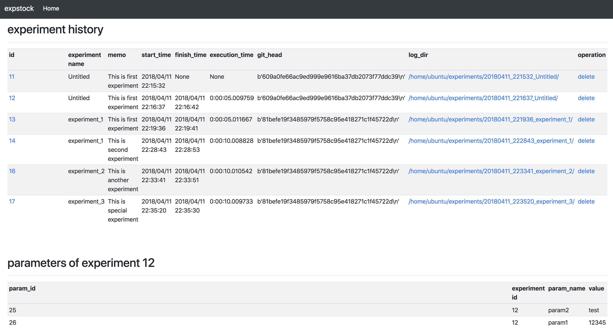

[](https://app.wercker.com/project/byKey/da135ca979d1a5dcb1ed72e2f5de1f65)[](https://opensource.org/licenses/MIT)[](https://gitter.im/expstock/expstock)
# EXPSTOCK

**expstock** is a tool to manage results of experiments in machine learning, data analysis, simulation, etc.

When we try to integrate machine learning models or performe simulation using a mathematical model, we execute the same script or program many times with different parameters or logics.
In order to summalize or reproduce our experiments, it is necessary to take environmental information comprehensively.

expstock can automatically save environmental information with text files with adding simple implementation.

## Getting Started

expstock has mainly two functions.

* Saving logs as test files(Basic Usage)
* Log Visualization(Optional)

### Basic Usage

There are two implementation types.
The simplest way is to surround the target mothod with the decorator as below.

```
from expstock import expstock

e = expstock.ExpStock(exp_name='test_experiment', report=True, dbsave=True)
@expstock.expstock(e)
def run(a, b):
    return a + b

e.append_param(a=a, b=b)
e.set_memo('This is the first experiment')
run(a, b)
```

But in case such as using Jupyter notebook, following implementation may be more convenient.

```
from expstock import expstock


e = expstock.ExpStock(dbsave=True)

e.append_param(a=a, b=b)
e.set_memo('This is the first experiment')
e.pre_stock()
result = a + b
e.result = result
e.post_stock()
```


#### Log Format

expstock saves environmental information with following directory structure. This is default setting, and we can change it.

```
experiments
├── <yyyymmdd_hhmmss>_<experiment_name>
│   ├── exec_time.txt
│   ├── git_diff.txt
│   ├── git_head.txt
│   ├── machine_info.txt
│   ├── memo.txt
│   ├── params.txt
│   ├── report.txt
│   ├── result.txt
│   ├── stderr.txt
│   └── stdout.txt

```

In the above, each file contains following information.

|file name | contents|user implementation|
|----------|---------|--------|
|exec_time.txt |start time, finish time, execution time of the experiment| - |
|git_diff.txt | result of `git diff`| - |
|git_head.txt |result of `git log -n 1 --format=%H`| - |
|machine_info.txt |machine info such as os version and hostname which can get with `platform` which is python builtin package| - |
|memo.txt |memo for each experiments. | e = ExpStock(memo = 'hoge') or e.set_memo(hoge) |
|params.txt |experiment parameter. | e = ExpStock(params=[{'a': a}, {'b': b }]) or  e.apend_params(a=a, b=b))|
|result.txt|return value of the experiment| e.result = func() or automatically set when using decorator|
|stdout.txt|result of sys.stdout| - |
|stderr.txt|result of sys.stderr| - |
|report.txt|summary of above information. if specify `report=True` when create Expstock instance, it creates report.txt| - |

In addition, we can save other files such as machine learning models in same directory with a simple command.

```
from sklearn.externals import joblib
joblib.dump(model, e.log_dirname)
```

### Log Visualization

If you use `e = ExpStock(dbsave=True)`, some types of logs are save on not only text but also sqlite tables.
And now, this tool can visualize your experiments with `expstock-server`.

```
$ expstock-server
```

You can access expstock-server with **<server-ip>:8000**.

 

## Getting expstock

### Requirements
No requirements for default usage(only text outputs).
If you use `dbsave` function and see logs on expstock dashboard, [sqlite](https://www.sqlite.org/index.html) is needed.


### Installation

You can get expstock from pypi.

```
pip install expstock
```

You can get source from github and build, too.

```
git clone https://github.com/chie8842/expstock
python setup.py install
```

